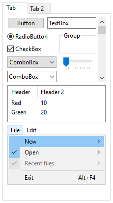
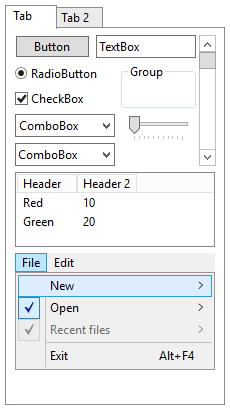

  

    

      <strong>PresentationTheme Aero</strong>
    

    <!--
    

      <a class="version-link" href="../RELEASENOTE.md">Version Notes</a>
      |
      <a class="github-link" href="https://github.com/gix/PresentationTheme.Aero">View in Github</a>
    

    -->
    

    A highly polished Windows Aero theme for WPF
    

    

      <a href="docs/getting-started.md" class="button"><i class="glyphicon glyphicon-send"></i>Getting Started</a>
      <a href="https://www.nuget.org/packages/PresentationTheme.Aero/" class="button"><i class="glyphicon glyphicon-download-alt"></i>Download Latest</a>
    

  

  

    

      

        <i class="glyphicon glyphicon-eye-open"></i>
        <section>
          <h2>Faithful Pixel-Perfect Recreation</h2>
          

            Includes proper animations, popup drop-shadows and Explorer-styles.
          

        </section>
      

    

  

  

    

      

        <i class="glyphicon glyphicon-retweet"></i>
        <section>
          <h2>Drop-in Replacement</h2>
          

            Can be used as a replacement for the default theme without requiring
            any further changes to XAML.

        </section>
      

    

  

  

    

      

        
Includes Windows 10 Aero, AeroLite and High Contrast themes.

      

    

  

