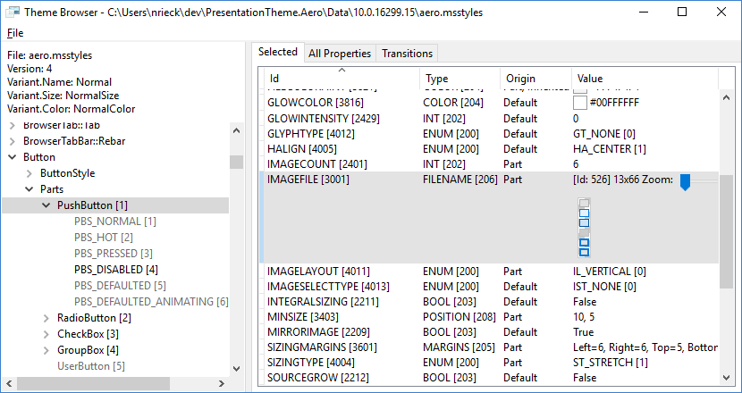
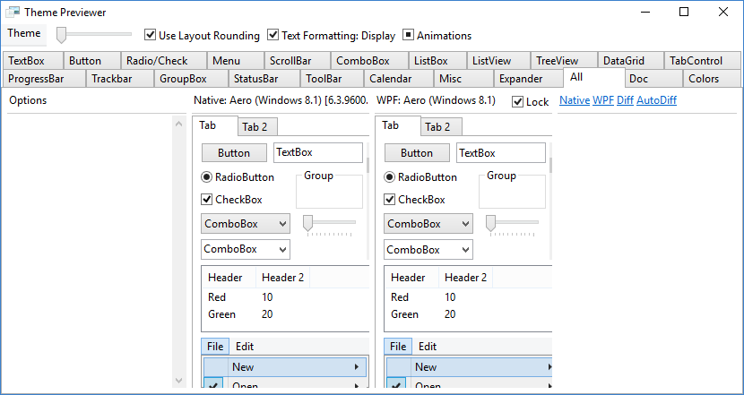

# PresentationTheme.Aero

## Overview

[PresentationTheme.Aero](https://gix.github.io/PresentationTheme.Aero/) is a
highly polished Windows Aero theme for WPF.

It currently includes the following themes:

- Windows 10 Aero
- Windows 10 Aero Lite
- Windows 10 High Contrast
- Windows 8/8.1 Aero
- Windows 8/8.1 Aero Lite
- Windows 8/8.1 High Contrast

See [https://gix.github.io/PresentationTheme.Aero/](https://gix.github.io/PresentationTheme.Aero/)
for more information.

## Additional Tools

This repository also contains several tools for Windows Visual Style files (.msstyles):

1. UxThemeEx: Provides many [Visual Style functions](https://msdn.microsoft.com/en-us/library/windows/desktop/bb773178.aspx)
   from uxtheme.dll with the ability to draw native controls using a specific
   .msstyles file. Not intended for general use as it is quite fragile and may
   break if certain Windows components are updated.
2. ThemeBrowser: Allows viewing and comparing .msstyles files. It also provides
   helpful utilities to inspect images and recreate those with WPF paths.

   

3. ThemePreviewer: Provides previews and comparisons of built-in controls using
   Windows and WPF themes.

   

## Building

Requires Visual Studio 2019 with .NET / C++ (v142) workloads including the
Windows 10 SDK component.

UxThemeEx requires [EasyHook](https://easyhook.github.io/) via
[vcpkg](https://github.com/microsoft/vcpkg)-built NuGet package. To build,
use the `Tools\Build-Dependencies.ps1` script from a Visual Studio developer
prompt or similar.

To build a nuget package, run `msbuild -t:Pack` in the root directory and check
the `dist` directory.

## License

Code licensed under the [MIT License](LICENSE.txt).
